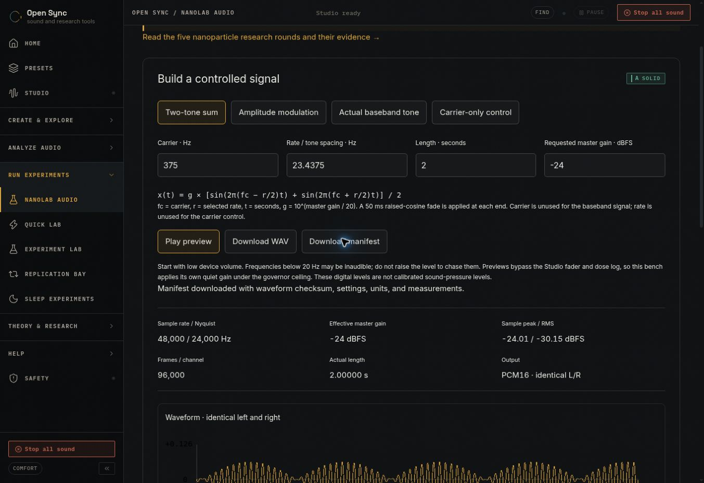

# NanoLab audio measurement bench

Open `/nano-lab/` from **Run experiments → NanoLab audio**. The page links to the five-round nanoparticle branch at the deployment-base-aware `research/#nanoparticles` URL. Building this software is not a completed research round or a physical experiment.

## Signal contract

The adapter in `src/nanolab/model.ts` composes the existing, unchanged `renderBinaural` and `renderMonaural` functions in `src/engine/synth.ts`. The former is used only as a two-sinusoid helper: its channels are summed and copied to both output channels. Every NanoLab condition is diotic (identical L/R), not a dichotic binaural stimulus.

Let `fc` be carrier frequency, `r` be the selected rate, `t` seconds, and `g = 10^(gainDb/20)`. Before edge fades:

| Condition | Digital signal | Stationary spectral lines |
| --- | --- | --- |
| Two-tone sum | `g [sin(2π(fc−r/2)t) + sin(2π(fc+r/2)t)] / 2` | `fc−r/2`, `fc+r/2`, amplitude `g/2` each |
| Amplitude modulation | `g [0.5 + 0.5 sin(2πrt)] sin(2πfct)` | `fc`, amplitude `g/2`; `fc±r`, amplitude `g/4` each |
| Actual baseband tone | `g sin(2πrt)` | `r`, amplitude `g` |
| Carrier-only control | `g sin(2πfct)` | `fc`, amplitude `g` |

The two-tone envelope magnitude repeats at `r`, but linear superposition creates no additional difference-frequency line. A source tone or AM sideband can already coincide with `r` for some allowed settings (for example, two-tone `fc=90, r=60` or AM `fc=80, r=40`). These statements concern stationary components; finite fades and windows introduce spectral spreading. A nonlinear operation such as squaring does produce a difference-frequency term. These results follow superposition and modulation algebra ([OpenStax, beats](https://openstax.org/books/university-physics-volume-1/pages/17-6-beats); [Carnegie Mellon, amplitude modulation](https://www.cs.cmu.edu/~15322/book/ch06/03.html)). Grade A labels cover this algebra and digital measurements only.

Inputs are finite and bounded before allocation: 48,000 samples/s; carrier 80–1,000 Hz; rate 1–80 Hz; duration 2–30 seconds; requested master gain −60 to −18 dBFS. All recipe fields are checked, including the unused carrier/rate controls in their respective control conditions. Actual tones and sidebands for the selected condition must be positive and below the 24,000 Hz Nyquist limit. The AM corner with carrier and rate both 80 Hz is excluded by the positive-sideband constraint; the other conditions accept it. Frames are rounded to the nearest sample; actual frame count and duration are displayed and exported. Raised-cosine fades last 50 ms at each edge, with zero-valued endpoints. The generator does not normalize RMS. Conditions have the same peak ceiling, not the same RMS or perceived loudness.

## Playback and reproducibility

NanoLab uses the shared `SessionProvider.togglePreview` ownership and `LiveEngine.playBuffer`; it creates no AudioContext of its own. The generated buffers already include the effective master gain, so `playBuffer` receives an additional gain of 0 dB. Effective gain is the quieter of the requested value and the current governor ceiling. Playback is gated by the advisory acknowledgment, active Studio session, mute, panic, and infant mode. Infant mode also disables downloads. Edits, governor or advisory changes, mute/panic, replacement previews, natural completion, failed starts, and page unmount clear ownership appropriately. Old completion callbacks cannot stop a newer preview. Preview playback bypasses the Studio fader and dose log, as explained on the page.

The same floating-point buffers feed playback, measurements, and PCM16 stereo encoding. Separate WAV and manifest download buttons avoid multiple automatic downloads. The JSON contains all effective synthesis settings, frames, sample rate, units, peak/RMS levels, FFT details, predicted components, the SHA-256 of the encoded WAV, and an explicit null physical calibration. Editing controls or changing a guard while hashing invalidates that download; unmount prevents a late download. SHA-256 uses the browser Web Crypto API available on HTTPS deployments.

The FFT inspects a centered segment clear of edge fades, up to 131,072 samples, with a periodic Hann window and coherent-gain correction. Bin spacing and observation duration are shown. Off-bin leakage broadens lines; the strongest-bin table is not an exact line-frequency estimator. Measurements describe the floating-point signal before PCM16 quantization. Sample peak is not reconstructed true peak, and dBFS is not dB SPL. The fixed-scale waveform uses sample minimum/maximum buckets to avoid hiding rapid oscillations through point decimation.

## Scope and verification

An acoustic experiment needs a measured speaker–room–microphone transfer function, calibration, noise/clipping checks, and repeatability. Magnetic or optical nanoparticle experiments need separately specified actuators, material response, field/intensity calibration, and controls. An audio frequency does not specify any of those quantities. No hardware, nanoparticle exposure, or medical outcome was tested.

Validation completed on 2026-09-26:

- `npm run check`: lint, TypeScript, **1,156 tests across 85 files**, and Vite/PWA production build passed.
- Eleven new model/UI tests include bounded allocation, finite/deterministic/diotic buffers, quiet levels and fades, direct float64 Fourier projections independent of the production FFT, PCM16 decoding, and an independent Node SHA-256 checksum.
- For the bin-centered test (`fc=375 Hz`, `r=23.4375 Hz`), the linear two-tone signal has lines at 363.28125 and 386.71875 Hz, while its square contains the 23.4375 Hz difference component. AM has lines at 351.5625, 375, and 398.4375 Hz. The baseband control has the 23.4375 Hz line.
- Happy DOM tests exercised the real shared session provider: exact preview/export buffer identity; natural end; edits; mute; panic; tightened governor; advisory gate; infant restrictions; failed audio start; invalid-input measurement clearing; stale exports; replacement ownership; and page unmount.
- This local verification stage did not test browser layout, real audio-device output, microphone calibration, or physical material response. The later live browser inspection is recorded below.

After the full check, an independent reviewer identified source components that can coincide with the chosen rate. The explanatory text now says no additional difference-frequency line; a new direct Fourier regression covers two-tone 90/60 Hz and AM 80/40 Hz. Active-component validation also preserves valid boundary settings in the other conditions. The final focused suite contains eleven passing tests, and targeted lint plus TypeScript passed.

No preset definitions or deterministic core DSP were changed. The existing route registry drives deployment route-shell generation, so `/nano-lab/` is included without workflow changes.

Final release gate: after the independent-review corrections, the team lead reran `npm run check`; lint, TypeScript, all 1,156 tests in 85 files, and the production build passed.

CI portability correction: GitHub’s slower runner exposed the five-second timeout in a test that allocated a matcher for every sample. The test now scans the same complete buffers and reports the first mismatch, preserving equality, finiteness, PCM stereo and numerical tolerances. No production renderer or test timeout was changed.

## Live release verification — 27 September 2026

Source `5bc616344881eaa9a5418304b535f8f8b3426170` passed [CI](https://github.com/occult-kranti/brainwave_opensync/actions/runs/36281004565) and [combined publication](https://github.com/occult-kranti/brainwave_opensync/actions/runs/36281004599). [GitHub Pages deployment 36281166038](https://github.com/occult-kranti/brainwave_opensync/actions/runs/36281166038) succeeded for artifact revision `74ceccf9e2c93db548e36df665b023fc11af8949`. The live deployment manifest returned the source revision above.

The published [NanoLab](https://occult-kranti.github.io/brainwave_opensync/nano-lab) was visually inspected in a desktop browser. At carrier 375 Hz, rate 23.4375 Hz, duration 2 s and requested gain −24 dBFS, two-tone bins matched 363.28125/386.71875 Hz at approximately −30.02 dBFS each. AM bins matched 351.5625/375/398.4375 Hz at approximately −36.04/−30.02/−36.04 dBFS. The page displayed 96,000 frames, waveform and peak/RMS measurements. No mobile visual pass is claimed.

The manifest button reported successful export with checksum and settings; the browser tool's download-event capture timed out, so browser-downloaded bytes were not inspected. Automated export tests and the separately fetched published round-five reference WAV supply byte-level checks. No sound was played, and no physical output or material response was measured. A preexisting tab initially showed the older service-worker version; the application's normal **UPDATE** button activated the new release.

